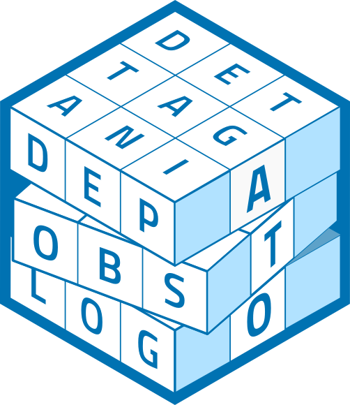

# Animal Telemetry Object 

<!-- badges: start -->

<!-- badges: end -->

This repository is a fastly evolving work in progress, with the intent to provide S4 classes to create, edit and expand ATOs. 

What _is_ an ATO? Read [Hugo's early vision of the ATO here](https://ato.trackyverse.org/articles/ATO-ecosystem.html).

Give it a [test drive with webR](https://webr.sh/#code=eJy1VsFu00AQvYefWLmVYkuO0wpUoQgOVU8IRFGTIiSErIk9cVa119buJiFc%2BQL%2BoTf%2BgDv%2FxaztOC7duJYCudibfft25s3OW%2F%2F4fi8gw5%2B3QnOdYnwe3NwXoJe%2Fxss8w%2FEG5%2BFKoRy352PQ8PtZwYXSkKZBAdEdJKjcyB1ezq6HPhtCpDEdej6TWOSKvWY0tdS6UJPxWEvCb9coFQZytBK8eo1xbVbuUGYhTW9AZUEuk%2FHQ8waDlM8lyK1Lu3jNoNyLJk9YJBE0FwkDNgfFI0a4QbYN6cFejZjAjevQu%2BPVfw4GMWplpjK4w5AGLqWGmmdIIYMKPlxP33yKdLXFZDLBr5AVqYlVY6R5LtTpjMAkQ1Z4%2FoD9%2FVtQqqHCKBcxEb6%2FDCnANLQAJUZodCCw5JCa3Q9veVODLTykrVAZ1xolcWy4XnbE7rMClMYz9yqPcUpVRJ85I8dnU54ISD1bRgqFymW4hnSF3VFOS2Tw0SBtkX6j5c7t7IqqEaWglGtqQWXc1wvi2K1GPqsmd2VbIsSWxIo032YoDNKKUHSwSV2Pyl60y164jf4ZSZFWtYqWIA2D7FkwFXChMUHZFVlTPJu4DWlEUSjUPeKoqMM0j8DIbi3JfvOpLlGB6fjDZO0e6CaTuiMk0BaCugSn7%2BihVzF%2BHp2%2F%2FNKVly2lhiQXSScLCZobPXtnlBcdLMdl1LAcl9LDDn%2FqeLTQvY92e01zumlRfbqtS1rNfLCBi1YDa0j2DUgDNwOxWlBIK1nm5cyWmGbgWPbqm0aRb4zauN6hD3kv3WNJKOmEEOzizGcnrHJsdQC6BtKkbrbnJf6M8QVb8K8YlwhmyGzWecDa55xuWi15ZEzTYALxtLfX1u3cXLx4azy7i7SycwslLeLrMpfQfvHtZLMtnoMJhXqUL7CtMAkSw9aiXn136G2BPepXo%2Bn7oI8PguDZzoYboHs%2BETLfPPLjvTZ0x7HHZBEU5iA%2BcNU2bYfWN5gi0NeM4hptou2oOxzJwmbQHWQ9jcluKPtk%2B%2FnSIXcrI%2F0fku2o%2F4lkTZzHSLZP9hjJepimscm9af4BhFCB3g%3D%3D).

Lastly, review and comment on the current [ATO Dictionary](https://ato.trackyverse.org/articles/ato-dictionary.html).
